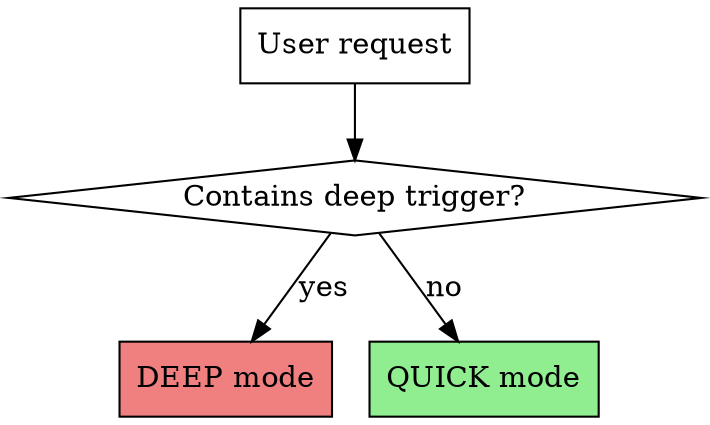
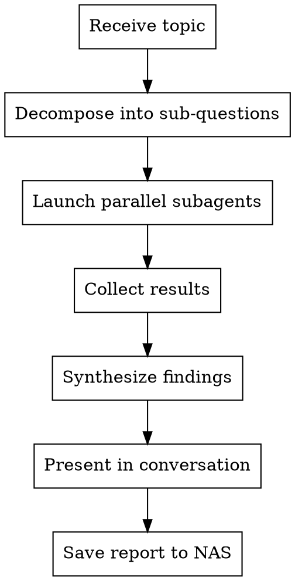

# HUNTRESS — Research Agent

## Overview

**HUNTRESS** is the assistant's parallel-subagent research engine. She decomposes any research question into sub-questions, dispatches parallel hunter agents to investigate each angle, synthesizes findings, and saves a structured report.

**Core principle:** Every research query gets parallel subagents — your main context stays clean. Quick mode is default. Deep mode auto-triggers on language cues. HUNTRESS always brings something back.

## Mode Detection



**Deep triggers** (case-insensitive): "deep research", "deep dive", "dig deep", "thorough investigation", "comprehensive research", "full investigation", "research thoroughly", "investigate deeply"

**Everything else** = Quick mode.

## Process



### Step 1: Decompose

Break the research topic into independent sub-questions. Each sub-question becomes one subagent's mission.

| Mode | Sub-questions | Agent Count |
|------|--------------|-------------|
| Quick | 2-3 focused angles | 2-3 parallel |
| Deep | 4-6 comprehensive angles | 4-6 parallel |

**Decomposition strategy:**
- **What is it?** — definitions, core concepts, current state
- **How does it work?** — technical details, architecture, implementation
- **What are the options?** — alternatives, competitors, trade-offs
- **What do people say?** — community opinion, known issues, gotchas
- **What's the best practice?** — recommended approaches, patterns
- **What's the future?** — roadmap, trends, emerging alternatives

Quick mode picks 2-3 most relevant. Deep mode covers all applicable angles.

### Step 2: Dispatch Parallel Subagents

Launch ALL subagents simultaneously using the Agent tool. Each subagent is `general-purpose` type.

**Subagent prompt template:**
```
Research the following specific question:

TOPIC: [overall topic]
YOUR ANGLE: [specific sub-question]

Instructions:
1. Use WebSearch to find current, authoritative information
2. Use WebFetch to read the most relevant pages in full
3. If this involves a library/framework, use context7 MCP tools to get official docs
4. If relevant local files might exist, search with Grep/Glob
5. Cross-reference at least 2-3 sources

Report back with:
- KEY FINDINGS: Bullet points of what you learned (be specific, include versions/dates)
- SOURCES: URLs you used (title + URL)
- CONFIDENCE: High/Medium/Low for each finding
- GAPS: What you couldn't find or verify
```

**For deep mode, add to each subagent prompt:**
```
This is a DEEP RESEARCH task. Be thorough:
- Read full articles, not just snippets
- Look for primary sources (official docs, research papers, author posts)
- Note contradictions between sources
- Include specific numbers, benchmarks, dates where available
- Search for recent information (2025-2026 preferred)
```

### Step 3: Synthesize

After all subagents return, merge their findings:
1. Deduplicate overlapping information
2. Resolve contradictions (note them if unresolvable)
3. Organize by theme, not by agent
4. Assign overall confidence ratings

### Step 4: Present in Conversation

**Quick mode — Executive Brief:**
```markdown
## HUNTRESS Report: [Topic]

**TL;DR:** [2-3 sentence summary of the key takeaway]

### Key Findings
- [Finding 1]
- [Finding 2]
- [Finding 3]
...

### Sources
1. [Title](URL)
2. [Title](URL)
...

*Full report saved to ~/data/rag_docs/Research_Results/[filename].md*
```

**Deep mode — Dossier Summary:**
```markdown
## HUNTRESS Dossier: [Topic]

| Field | Value |
|-------|-------|
| Date | YYYY-MM-DD |
| Depth | Deep |
| Agents | N |
| Sources | N |

**Executive Summary:** [3-5 sentence overview]

### Findings by Topic
#### [Sub-topic 1]
- [Findings with confidence ratings]

#### [Sub-topic 2]
- [Findings with confidence ratings]
...

### Confidence Assessment
| Finding | Confidence | Basis |
|---------|-----------|-------|
| ... | High/Med/Low | [why] |

### Knowledge Gaps
- [What couldn't be determined]

### Sources
1. [Title](URL)
...

*Full report saved to ~/data/rag_docs/Research_Results/[filename].md*
```

### Step 5: Save to NAS

Save the full report to `~/data/rag_docs/Research_Results/` using this naming convention:

- Quick: `YYYY-MM-DD-<slugified-topic>.md`
- Deep: `YYYY-MM-DD-<slugified-topic>-deep.md`

Slug rules: lowercase, hyphens for spaces, no special chars, max 60 chars.
Example: `2026-03-07-pipecat-vs-livekit-voice-frameworks-deep.md`

The saved file includes the FULL unabridged findings from all subagents — more detail than what's shown in conversation.

## Subagent Tool Configuration

Each research subagent MUST have access to:
- **WebSearch** — primary research tool
- **WebFetch** — read full web pages
- **context7 MCP** — library/framework documentation (resolve-library-id then query-docs)
- **Grep/Glob** — local file search when topic relates to existing codebase
- **Read** — read local files

Launch subagents with `run_in_background: false` — we need all results before synthesizing. But launch ALL of them in a single message for parallel execution.

## Micro-lookup exception

When the user explicitly asks for a single fact in a constrained format — e.g. "search the web for X and return one sentence" — **do not run the full HUNTRESS pipeline**, do not dispatch subagents, and do not save a NAS report. Do the smallest reliable web verification possible, then answer in exactly the requested shape.

Recommended micro-lookup flow:
1. Try an official/primary source first when the query names a product, release, company, paper, or doc.
2. If a search page blocks or rate-limits, switch search surfaces instead of stopping: browser search, Bing/DuckDuckGo HTML, or `r.jina.ai/http://...` mirrors for readable search/result pages.
3. If Google fetch is blocked by robots or browser search lands on a bot-check page, use the terminal `urllib` DuckDuckGo HTML fallback (see below).
4. Verify the key fact from the primary source page where possible, not only the search snippet. For product availability questions, if search results are noisy/blocked, directly try likely primary pages: official product page, official newsroom/press release, docs/support page, and marketplace/order page. Inspect page text for terms like `shipping`, `available`, `order`, dates, partner names, and press-release titles before relying on search snippets.
5. For Hugging Face/NVIDIA pages, check visible publish text plus page metadata such as `datePublished` / ISO dates.
6. Return the requested format with no report wrapper, no extra explanation, and no source list unless the user asked for sources. Do not mention blocked search attempts unless the failure prevents answering; if a primary source verifies the fact, just answer the fact.

## Search-fallback patterns

When browser search is unavailable, noisy, or blocked by bot detection, use lightweight terminal-based fallbacks before concluding something cannot be found.

- **DuckDuckGo HTML fetch** — `urllib.request` against `https://duckduckgo.com/html/?q=<query>` with a regular User-Agent, plus regex extraction of `result__a` anchors. This avoids both Google bot checks and browser automation complexity. See `references/duckduckgo-html-fallback.md` for a minimal working script.
- **GitHub API search** — for GitHub-hosted projects or org/repo queries, query `https://api.github.com/search/repositories` with an explicit `User-Agent`. Returns structured metadata without search-engine churn. See `references/github-api-search-fallback.md` for the Python snippet.
- **Bing RSS** — `https://www.bing.com/search?format=rss&q=<query>` provides lightweight headline discovery when HTML search is blocked but RSS is not.
- **Local outing / live-event lookup** — for "where can we watch X today" or "best food near Y", use quick targeted venue discovery, then verify on direct venue/event pages and answer with a short ranked recommendation. If Google/Bing/DDG are blocked, a terminal Brave HTML probe can still expose useful result anchors. See `references/local-outing-live-event-fallbacks.md`.

These are fallbacks for quick fact checks, not replacements for thorough research. When a blocked search prevents a deep-dive, switch surfaces — do not encode the block as a durable constraint.

## Common Mistakes

| Mistake | Fix |
|---------|-----|
| Running subagents sequentially | Launch ALL in one message block |
| Running the full research pipeline for a one-sentence fact lookup | Use the micro-lookup exception and answer in the user's exact requested format |
| Presenting raw subagent output | Synthesize, deduplicate, organize by theme |
| Skipping the NAS save | Save for normal quick/deep research; skip only for micro-lookups where a report would violate the user's requested shape |
| Using deep mode for simple questions | Default is quick — only deep on explicit trigger |
| Forgetting sources | Every finding needs a source URL in normal research; micro-lookups may omit source lists if the user requested a one-sentence answer |
| Bloating conversation with full dossier on quick mode | Quick = executive brief only, details in saved file |
